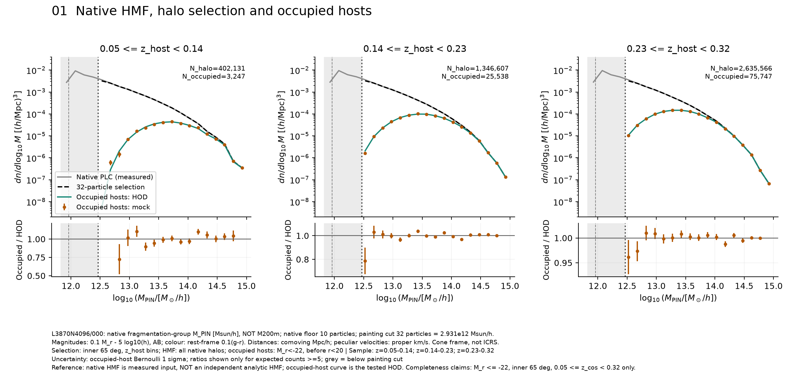
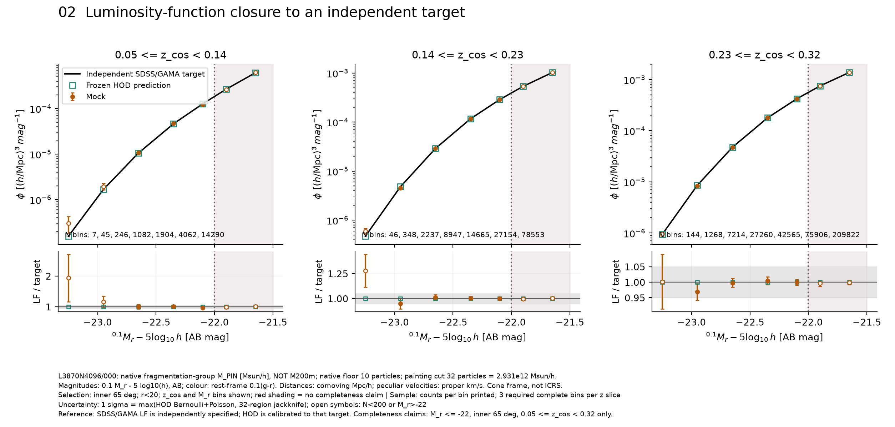
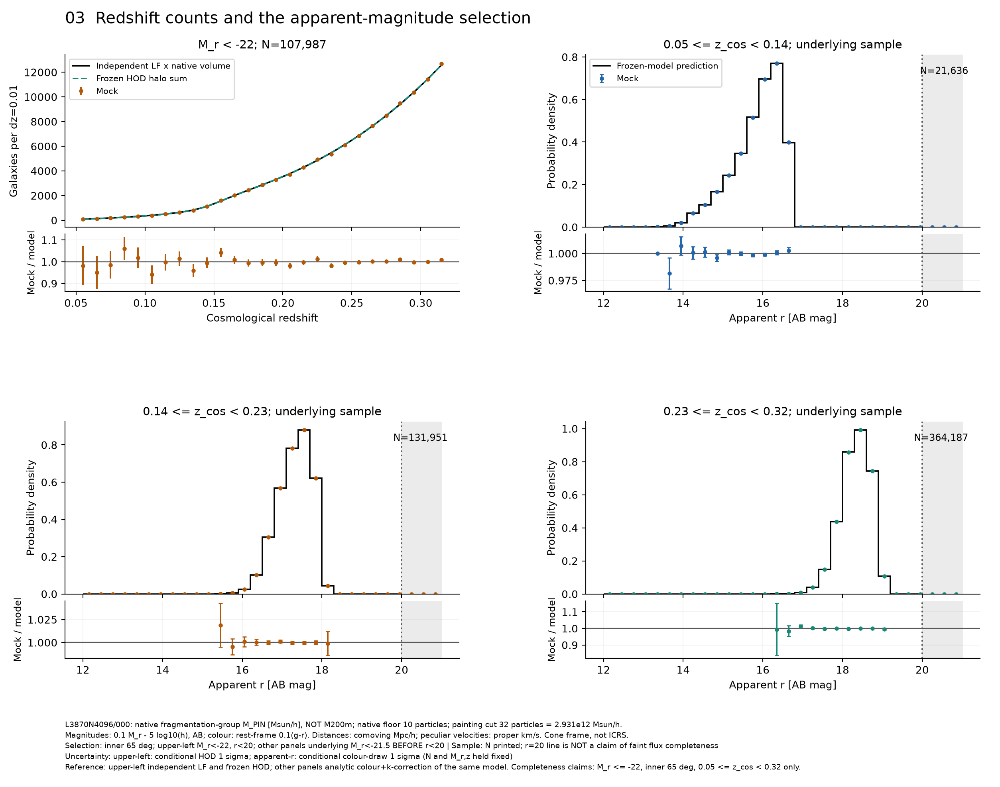
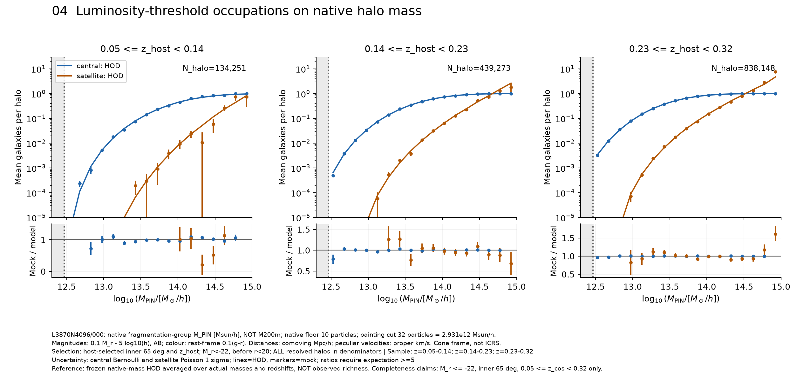
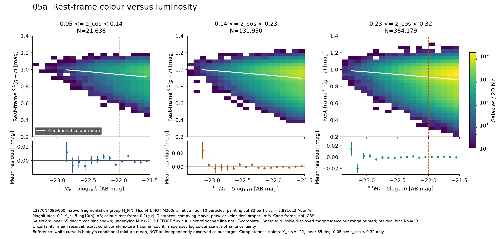
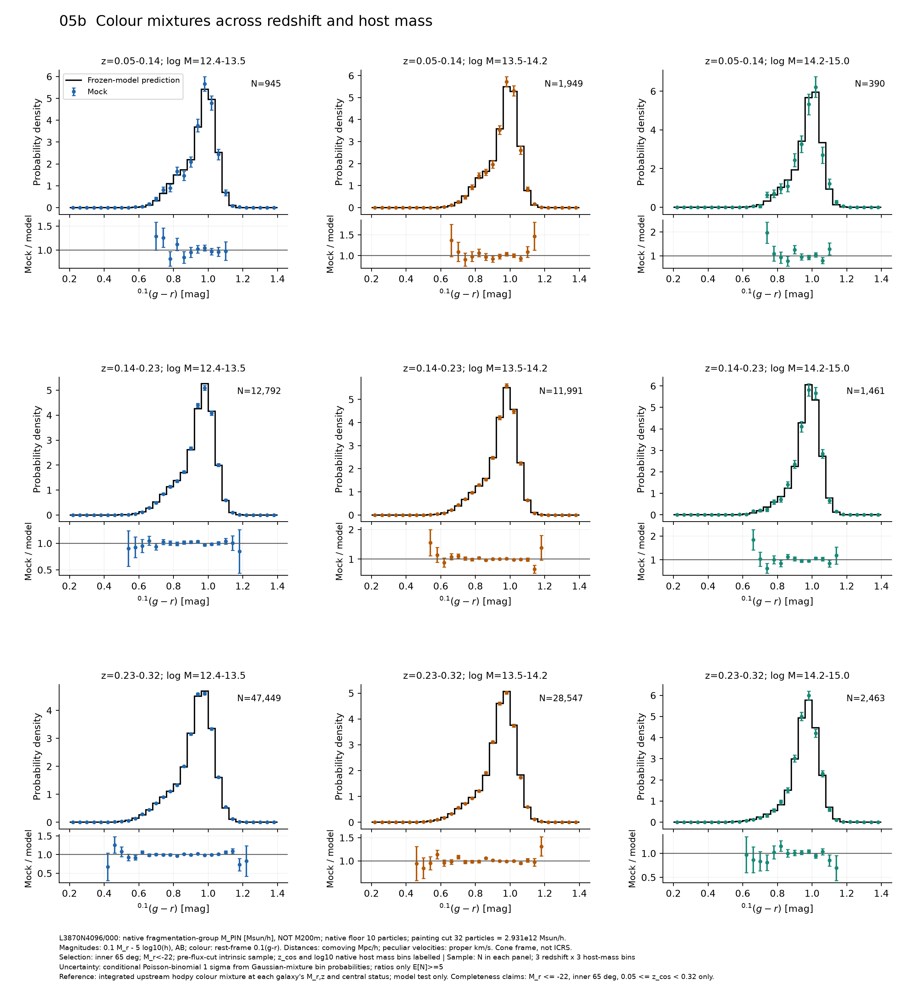
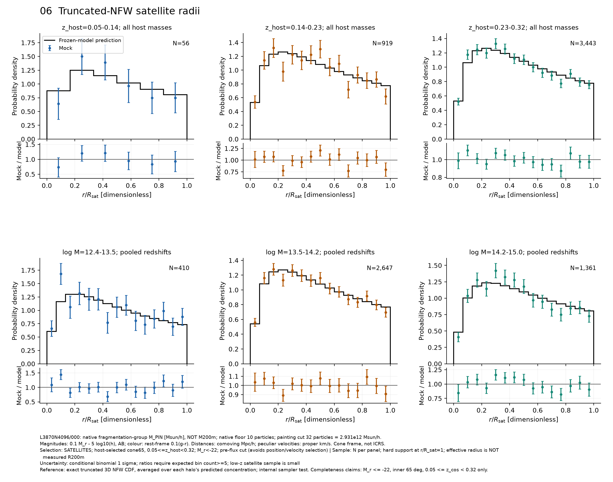
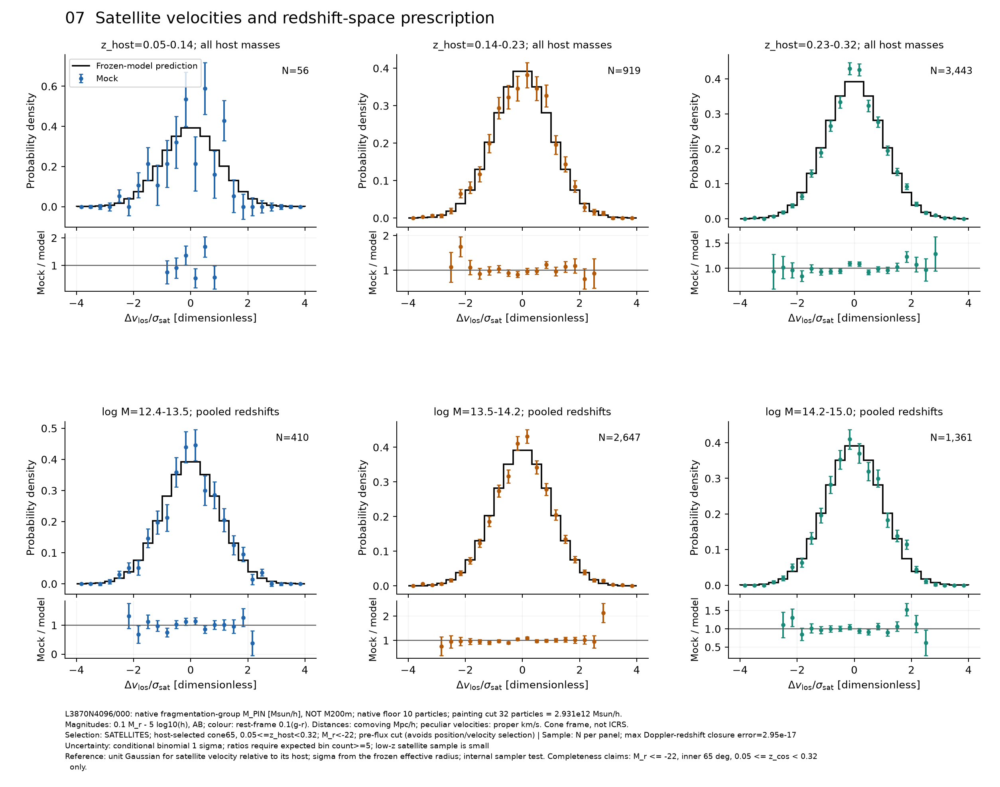
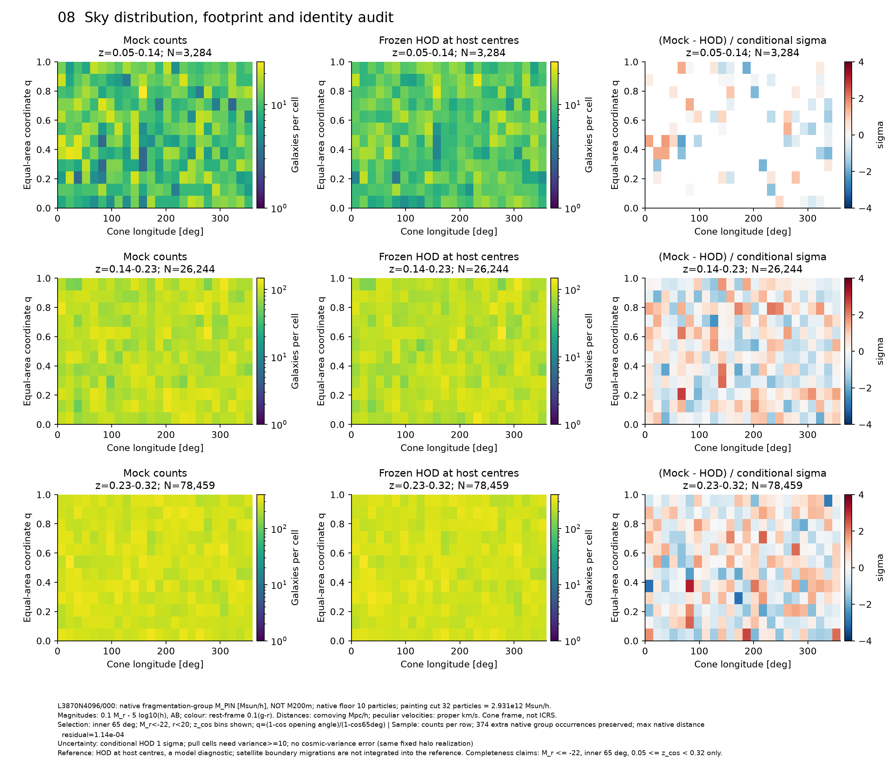
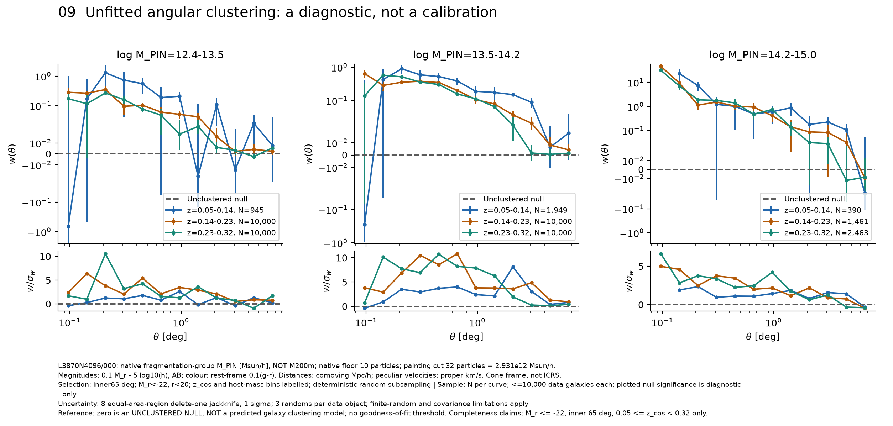

# Frozen PINOCCHIO-hodpy diagnostic report

## Scope and reproducibility

This audit reads the completed **660,873-galaxy** catalogue from real L3870N4096/000 data. No model parameter, calibration table or galaxy value is changed. The eight groups below were confirmed for this audit. Group 09 is an additional unfitted diagnostic.

The only independent observational target here is the fixed SDSS/GAMA r-band LF supplied by hodpy. HOD, colour, NFW and velocity curves are **predictions of the same frozen model being tested**. The native HMF is measured input. Clustering is compared only with an unclustered null, not an observed galaxy-clustering target.

## Conventions and selections

- Simulation: L=3870 Mpc/h, 4096^3 particles, seed 1386. Omega_m=0.3913, Omega_b=0.0419, Omega_DE=0.6087, h=0.7276, n_s=0.9312, sigma8=0.60850325, w0=-1.168, wa=-0.6605.
- M_PIN is native fragmentation-group particle-count mass [Msun/h], not M200m or M200c. Particle mass=9.160181752e10 Msun/h; native minimum=10 particles; painting minimum=32 particles (2.931258161e12 Msun/h).
- Positions and radii: comoving Mpc/h. Velocities: proper peculiar km/s. Sky coordinates: cone-aligned longitude/latitude, not ICRS. Cosmological and Doppler-observed redshifts remain distinct.
- Magnitudes: AB, ^0.1 M_r-5log10(h). Colours: rest-frame ^0.1(g-r), not observed multiband photometry. Underlying sample M_r<-21.5; survey flag r<20 is applied only where labelled.
- Audit redshift bins: [0.05,0.14), [0.14,0.23), [0.23,0.32). Host log10(M_PIN/[Msun/h]) bins: [12.4,13.5), [13.5,14.2), [14.2,15.0), with the 32-particle lower cut inside the first bin. Inner cone half-angle=65 deg; the original 70 deg cone and z=0.04-0.33 input provide satellite buffers.
- LF claims require M_r<=-22, model-estimated omitted native low-mass fraction<1%, support above the native 10-particle floor, and N>=200 in each differential bin. Sparse bright bins and the displayed faint extension are labelled diagnostics, not completeness claims.
- HOD and satellite diagnostics select on **host** coordinates/redshift before flux selection, avoiding radial/velocity selection bias. LF, redshift counts, sky and clustering use final galaxy coordinates. Colour distributions are before flux selection; apparent-r references explicitly integrate the colour-dependent selection.

## Frozen prescriptions

The luminosity-dependent hodpy central Bernoulli and satellite Poisson occupations use M_PIN. The existing calibration shifts all three HOD mass scales together at each luminosity threshold and redshift cell, against the measured native PLC HMF. The numerical thresholds and shifts are archived unchanged in frozen_hod.npz. This audit does not rerun the calibration or update those tables.

Satellite radius: R_sat,com=[3 M_PIN/(4 pi 200 rho_mean,com)]^(1/3). Concentration: c_sat=5 (M_PIN/1e14 Msun/h)^(-0.1) (1+z_host)^(-0.5). Draws follow the NFW enclosed-mass CDF truncated at R_sat; there is no measured spherical-overdensity radius. Velocities add independent Gaussian components with sigma_1D=[G M_PIN (1+z_host)/(2 R_sat,com)]^(1/2). Centrals inherit host positions and velocities. Observed redshift is z_cos+(1+z_cos) v_los/c.

The independent LF combines the fixed SDSS cumulative table and hodpy's evolving GAMA Schechter prescription (phi_star=0.0094 h^3 Mpc^-3, M_star=-20.7, alpha=-1.23, P=1.8, Q=0.7). The exact transition and source hashes are frozen in the input metadata and upstream code. Colours use hodpy's two-Gaussian mixture at each M_r, z_cos and central/satellite status; apparent r uses its colour-dependent GAMA k-correction. This is not an independently tested colour observation or complete multiband photometry.

## Uncertainties and references

LF errors use max(conditional Bernoulli+Poisson HOD sigma, 32 equal-area-region jackknife sigma). The required tolerance remains max(5%,3 sigma). Other count/colour/radius histograms condition on the listed sample: their analytic bin probabilities give sum p(1-p), not an ensemble cosmic-variance covariance. Gaussian-mixture means and standardized sequence widths are tested explicitly in colour_moments.csv. NFW/velocity KS tests use a 1% Bonferroni familywise threshold across the reported strata. These tests are correlated across overlapping redshift and mass projections, so the correction is conservative.

The apparent-r prediction is integrated analytically over each clipped, piecewise-linear colour-to-k-correction interval at the actual M_r,z and central/satellite status. It is not an independent survey number-count prediction. It includes both Gaussian tails; the sample is not a complete faint flux-limited survey.

Clustering uses angular Landy-Szalay, deterministic subsampling at <=10,000 galaxies per stratum, three uniform randoms per data object, and eight equal-area delete-one regions. Jackknife limitations and finite random-pair noise remain, particularly in small-angle sparse bins. No covariance inversion, clustering fit or richness calibration is attempted.

The aggregate occupation chi-square is reported only for bins with expected counts>=20 and variance>=10, with alpha=0.01. Its p-value indicates mild excess scatter, not exact agreement. Sparse saturated-central bins are excluded from that Gaussian statistic but remain in the binned data. Histogram residual summaries require the same count/variance cuts; they are descriptive, not independent multiple-bin significance tests.

Visible sparse-bin excursions are not hidden: the lowest-z brightest LF bin has only seven galaxies; the highest-z log10(M_PIN)=14.85-15.0 occupation bin has five hosts and 38 bright satellites versus 23.56 expected (2.98 conditional sigma). The lowest-z radial/velocity sample has only 56 satellites, so its radial histogram uses six bins instead of fifteen. The unbinned KS tests do not depend on this plotting choice. These are plausible sampling fluctuations, not evidence for observed richness agreement.

## Rerun

```bash
/home/tcastro/miniforge3/envs/geppetto-dev/bin/python examples/diagnose_pinocchio_galaxies.py --config examples/pinocchio_galaxy_diagnostics_config.json
# Replot from the saved CSV/JSON data without the large input/catalogue:
/home/tcastro/miniforge3/envs/geppetto-dev/bin/python examples/diagnose_pinocchio_galaxies.py --config examples/pinocchio_galaxy_diagnostics_config.json --plot-only
/usr/bin/python3 examples/render_pinocchio_galaxy_report.py --input-dir examples/pinocchio_galaxy_diagnostics
```

The complete frozen configuration, input/code hashes, package versions and command are in manifest.json and frozen_model.json; frozen_hod.npz is a byte-for-byte copy of the existing calibration. Plotting and rendering source snapshots accompany the figures in code/. The PDF renderer uses reportlab; the plotting code uses the existing galaxy extras. No calibration function is called. Plot-only needs NumPy, SciPy and Matplotlib, but not the simulation or hodpy.

## LF results

| z range | M_r bin | N | Target LF | HOD LF | Mock LF | HOD residual | Mock residual | Allowed | Status |
|---|---|---:|---:|---:|---:|---:|---:|---:|---|
| 0.05-0.14 | [-22.8,-22.5) | 246 | 1.05792e-05 | 1.05798e-05 | 1.06306e-05 | +0.0060% | +0.485% | 23.26% | PASS |
| 0.05-0.14 | [-22.5,-22.2) | 1,082 | 4.63789e-05 | 4.63809e-05 | 4.67572e-05 | +0.0043% | +0.816% | 10.60% | PASS |
| 0.05-0.14 | [-22.2,-22.0) | 1,904 | 1.27270e-04 | 1.27274e-04 | 1.23418e-04 | +0.0032% | -3.026% | 9.53% | PASS |
| 0.14-0.23 | [-22.8,-22.5) | 2,237 | 2.89547e-05 | 2.89563e-05 | 2.92509e-05 | +0.0053% | +1.023% | 8.17% | PASS |
| 0.14-0.23 | [-22.5,-22.2) | 8,947 | 1.16618e-04 | 1.16622e-04 | 1.16990e-04 | +0.0034% | +0.320% | 5.47% | PASS |
| 0.14-0.23 | [-22.2,-22.0) | 14,665 | 2.87994e-04 | 2.88000e-04 | 2.87638e-04 | +0.0022% | -0.124% | 5.00% | PASS |
| 0.23-0.32 | [-22.8,-22.5) | 7,214 | 4.75576e-05 | 4.75599e-05 | 4.74646e-05 | +0.0048% | -0.196% | 5.00% | PASS |
| 0.23-0.32 | [-22.5,-22.2) | 27,260 | 1.78448e-04 | 1.78453e-04 | 1.79358e-04 | +0.0029% | +0.510% | 5.00% | PASS |
| 0.23-0.32 | [-22.2,-22.0) | 42,565 | 4.20302e-04 | 4.20309e-04 | 4.20086e-04 | +0.0016% | -0.052% | 5.00% | PASS |

LF units are h^3 Mpc^-3 mag^-1; residual=(value/target-1). Exact volumes, Poisson/HOD/jackknife errors and all additional bins are in luminosity_function.csv; cumulative checks and completeness estimates are in separate CSVs.

## Figure groups

### 01  Native HMF, halo selection and occupied hosts



L3870N4096/000: native fragmentation-group M_PIN [Msun/h], NOT M200m; native floor 10 particles; painting cut 32 particles = 2.931e12 Msun/h.
Magnitudes: 0.1 M_r - 5 log10(h), AB; colour: rest-frame 0.1(g-r). Distances: comoving Mpc/h; peculiar velocities: proper km/s. Cone frame, not ICRS.
Selection: inner 65 deg, z_host bins; HMF: all native halos; occupied hosts: M_r<-22, before r<20 | Sample: z=0.05-0.14; z=0.14-0.23; z=0.23-0.32
Uncertainty: occupied-host Bernoulli 1 sigma; ratios shown only for expected counts >=5; grey = below painting cut
Reference: native HMF is measured input, NOT an independent analytic HMF; occupied-host curve is the tested HOD. Completeness claims: M_r <= -22, inner 65 deg, 0.05 <= z_cos < 0.32 only.

### 02  Luminosity-function closure to an independent target



L3870N4096/000: native fragmentation-group M_PIN [Msun/h], NOT M200m; native floor 10 particles; painting cut 32 particles = 2.931e12 Msun/h.
Magnitudes: 0.1 M_r - 5 log10(h), AB; colour: rest-frame 0.1(g-r). Distances: comoving Mpc/h; peculiar velocities: proper km/s. Cone frame, not ICRS.
Selection: inner 65 deg; r<20; z_cos and M_r bins shown; red shading = no completeness claim | Sample: counts per bin printed; 3 required complete bins per z slice
Uncertainty: 1 sigma = max(HOD Bernoulli+Poisson, 32-region jackknife); open symbols: N<200 or M_r>-22
Reference: SDSS/GAMA LF is independently specified; HOD is calibrated to that target. Completeness claims: M_r <= -22, inner 65 deg, 0.05 <= z_cos < 0.32 only.

### 03  Redshift counts and the apparent-magnitude selection



L3870N4096/000: native fragmentation-group M_PIN [Msun/h], NOT M200m; native floor 10 particles; painting cut 32 particles = 2.931e12 Msun/h.
Magnitudes: 0.1 M_r - 5 log10(h), AB; colour: rest-frame 0.1(g-r). Distances: comoving Mpc/h; peculiar velocities: proper km/s. Cone frame, not ICRS.
Selection: inner 65 deg; upper-left M_r<-22, r<20; other panels underlying M_r<-21.5 BEFORE r<20 | Sample: N printed; r=20 line is NOT a claim of faint flux completeness
Uncertainty: upper-left: conditional HOD 1 sigma; apparent-r: conditional colour-draw 1 sigma (N and M_r,z held fixed)
Reference: upper-left independent LF and frozen HOD; other panels analytic colour+k-correction of the same model. Completeness claims: M_r <= -22, inner 65 deg, 0.05 <= z_cos < 0.32 only.

### 04  Luminosity-threshold occupations on native halo mass



L3870N4096/000: native fragmentation-group M_PIN [Msun/h], NOT M200m; native floor 10 particles; painting cut 32 particles = 2.931e12 Msun/h.
Magnitudes: 0.1 M_r - 5 log10(h), AB; colour: rest-frame 0.1(g-r). Distances: comoving Mpc/h; peculiar velocities: proper km/s. Cone frame, not ICRS.
Selection: host-selected inner 65 deg and z_host; M_r<-22, before r<20; ALL resolved halos in denominators | Sample: z=0.05-0.14; z=0.14-0.23; z=0.23-0.32
Uncertainty: central Bernoulli and satellite Poisson 1 sigma; lines=HOD, markers=mock; ratios require expectation >=5
Reference: frozen native-mass HOD averaged over actual masses and redshifts, NOT observed richness. Completeness claims: M_r <= -22, inner 65 deg, 0.05 <= z_cos < 0.32 only.

### 05a  Rest-frame colour versus luminosity



L3870N4096/000: native fragmentation-group M_PIN [Msun/h], NOT M200m; native floor 10 particles; painting cut 32 particles = 2.931e12 Msun/h.
Magnitudes: 0.1 M_r - 5 log10(h), AB; colour: rest-frame 0.1(g-r). Distances: comoving Mpc/h; peculiar velocities: proper km/s. Cone frame, not ICRS.
Selection: inner 65 deg; z_cos bins shown; underlying M_r<-21.5 BEFORE flux cut; right of dashed line not LF-complete | Sample: N inside displayed magnitude/colour range printed; residual bins N>=20
Uncertainty: mean residual: exact conditional-mixture 1 sigma; count image uses log colour scale, not an uncertainty
Reference: white curve is hodpy's conditional mixture mean, NOT an independently observed colour target. Completeness claims: M_r <= -22, inner 65 deg, 0.05 <= z_cos < 0.32 only.

### 05b  Colour mixtures across redshift and host mass



L3870N4096/000: native fragmentation-group M_PIN [Msun/h], NOT M200m; native floor 10 particles; painting cut 32 particles = 2.931e12 Msun/h.
Magnitudes: 0.1 M_r - 5 log10(h), AB; colour: rest-frame 0.1(g-r). Distances: comoving Mpc/h; peculiar velocities: proper km/s. Cone frame, not ICRS.
Selection: inner 65 deg; M_r<-22; pre-flux-cut intrinsic sample; z_cos and log10 native host mass bins labelled | Sample: N in each panel; 3 redshift x 3 host-mass bins
Uncertainty: conditional Poisson-binomial 1 sigma from Gaussian-mixture bin probabilities; ratios only E[N]>=5
Reference: integrated upstream hodpy colour mixture at each galaxy's M_r,z and central status; model test only. Completeness claims: M_r <= -22, inner 65 deg, 0.05 <= z_cos < 0.32 only.

### 06  Truncated-NFW satellite radii



L3870N4096/000: native fragmentation-group M_PIN [Msun/h], NOT M200m; native floor 10 particles; painting cut 32 particles = 2.931e12 Msun/h.
Magnitudes: 0.1 M_r - 5 log10(h), AB; colour: rest-frame 0.1(g-r). Distances: comoving Mpc/h; peculiar velocities: proper km/s. Cone frame, not ICRS.
Selection: SATELLITES; host-selected cone65, 0.05<=z_host<0.32; M_r<-22; pre-flux cut (avoids position/velocity selection) | Sample: N per panel; hard support at r/R_sat=1; effective radius is NOT measured R200m
Uncertainty: conditional binomial 1 sigma; ratios require expected bin count>=5; low-z satellite sample is small
Reference: exact truncated 3D NFW CDF, averaged over each halo's predicted concentration; internal sampler test. Completeness claims: M_r <= -22, inner 65 deg, 0.05 <= z_cos < 0.32 only.

### 07  Satellite velocities and redshift-space prescription



L3870N4096/000: native fragmentation-group M_PIN [Msun/h], NOT M200m; native floor 10 particles; painting cut 32 particles = 2.931e12 Msun/h.
Magnitudes: 0.1 M_r - 5 log10(h), AB; colour: rest-frame 0.1(g-r). Distances: comoving Mpc/h; peculiar velocities: proper km/s. Cone frame, not ICRS.
Selection: SATELLITES; host-selected cone65, 0.05<=z_host<0.32; M_r<-22; pre-flux cut (avoids position/velocity selection) | Sample: N per panel; max Doppler-redshift closure error=2.95e-17
Uncertainty: conditional binomial 1 sigma; ratios require expected bin count>=5; low-z satellite sample is small
Reference: unit Gaussian for satellite velocity relative to its host; sigma from the frozen effective radius; internal sampler test. Completeness claims: M_r <= -22, inner 65 deg, 0.05 <= z_cos < 0.32 only.

### 08  Sky distribution, footprint and identity audit



L3870N4096/000: native fragmentation-group M_PIN [Msun/h], NOT M200m; native floor 10 particles; painting cut 32 particles = 2.931e12 Msun/h.
Magnitudes: 0.1 M_r - 5 log10(h), AB; colour: rest-frame 0.1(g-r). Distances: comoving Mpc/h; peculiar velocities: proper km/s. Cone frame, not ICRS.
Selection: inner 65 deg; M_r<-22, r<20; z_cos bins shown; q=(1-cos opening angle)/(1-cos65deg) | Sample: counts per row; 374 extra native group occurrences preserved; max native distance residual=1.14e-04
Uncertainty: conditional HOD 1 sigma; pull cells need variance>=10; no cosmic-variance error (same fixed halo realization)
Reference: HOD at host centres, a model diagnostic; satellite boundary migrations are not integrated into the reference. Completeness claims: M_r <= -22, inner 65 deg, 0.05 <= z_cos < 0.32 only.

### 09  Unfitted angular clustering: a diagnostic, not a calibration



L3870N4096/000: native fragmentation-group M_PIN [Msun/h], NOT M200m; native floor 10 particles; painting cut 32 particles = 2.931e12 Msun/h.
Magnitudes: 0.1 M_r - 5 log10(h), AB; colour: rest-frame 0.1(g-r). Distances: comoving Mpc/h; peculiar velocities: proper km/s. Cone frame, not ICRS.
Selection: inner65 deg; M_r<-22, r<20; z_cos and host-mass bins labelled; deterministic random subsampling | Sample: N per curve; <=10,000 data galaxies each; plotted null significance is diagnostic only
Uncertainty: 8 equal-area-region delete-one jackknife, 1 sigma; 3 randoms per data object; finite-random and covariance limitations apply
Reference: zero is an UNCLUSTERED NULL, NOT a predicted galaxy clustering model; no goodness-of-fit threshold. Completeness claims: M_r <= -22, inner 65 deg, 0.05 <= z_cos < 0.32 only.

## Passed checks, discrepancies and likely causes

| Check | Result | Evidence / visible discrepancy | Interpretation or likely cause |
|---|---|---|---|
| Frozen inputs and model | PASS | Catalogue, input, calibration and model-source hashes verified before/after; no fitter called | Read-only audit |
| Independent LF target | PASS | 9 complete bins; min N=246; max mock residual=3.026%; cumulative=0.00838% | Fixed target is fitted by the HOD; remaining mock deviations are stochastic and include boundary migrations |
| Native-mass completeness | LIMIT | 10-particle native floor; 32-particle painting cut; max missing fraction in claimed bins=0.7532% | Fainter M_r>-22 and sparse bright bins are diagnostic only; not a physical halo-finder convergence test |
| HOD occupation | PASS | Conditional chi2=88.9/61 bins; p=0.0114, alpha=.01 | Mild excess scatter; E[N]>=20 and variance>=10 for Gaussian chi2. Compatible at the stated threshold, not a precision richness validation |
| Conditional colours | PASS | 80 mixture/mean/width tests; 0 failures at familywise alpha=.01 | Same hodpy prescription tested, not independent observed colour data; red probability saturates in bright satellite bins |
| NFW radial / Gaussian velocity draws | PASS | 12 mass/redshift-stratified KS tests; 0 failures; minimum p=0.0242 | Model tests only; low-z satellites have limited statistics |
| Units, support and redshift closure | PASS | Integrity passed=True; Doppler closure=2.95e-17 | R_sat is an effective model radius, not measured R200m |
| Native PLC identities | CAVEAT | 374 extra group-ID occurrences; 59 extra centrals across persistent IDs | Nearby distinct native crossing records retained; one central per unique PLC occurrence, not persistent ID |
| Sky / distance closure | CAVEAT | Native distance max relative mismatch=1.14e-04; sky residuals shown | Finite-precision native table/PLC; host-centre sky prediction omits satellite boundary migrations |
| Angular clustering | DIAGNOSTIC | Measured across 3 z and 3 host-mass bins, with spatial jackknife; no fitting | Nonzero clustering relative to the unclustered null is expected; no observed clustering or richness claim |

References: [hodpy](https://github.com/amjsmith/hodpy), pinned d303bef896fe6a92593d815f640f02865f11df60; [Smith et al. (2017)](https://arxiv.org/abs/1701.06581). These establish the implemented prescriptions, not independent agreement with observed clustering or cluster richness.
